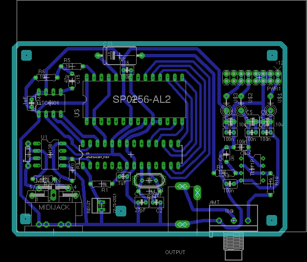

Accepts MIDI signals to control a speech synthesizer IC. LTC6904 (on a DIP adapter) controls the clock frequency of the SP chip.

## MIDI Sysex Messages

Function   | Start | Prefix       | Message | End
-----------|-------|--------------|---------|-------
Set Channel| F0    | 77 34 01 00  | cc | f7
Speak Word | F0    | 77 34 01 01  | a1 a2 a3 ... (allophones) | f7
Assign Word| F0    | 77 34 01 02  | nn (note #) a1 a2 a3 ... (allophones) | f7
Save Config| F0    | 77 34 01 03  | (none) | f7
Load Config| F0    | 77 34 01 04  | (none) | f7
Dump Request| F0    | 77 34 01 05  | (none) | f7
Sysex Dump | F0    | 77 34 01 05  | (assignment data) | f7
Clock Freq | F0    | 77 34 01 06  | 0\[bits 13-7\] 0\[bits 6-0\] (khz) | f7

After words have been assigned to keys, the device operates as a monophonic synthesizer, playing the word assigned to a key when that key is pressed.

If a "speak word" message is received while a key is down, the word is assigned to that key.

MIDI notes on the base channel trigger words that have been assigned to those keys.

MIDI notes on the base channel + 1 set the pitch by altering the clock frequency of the speech chip.

